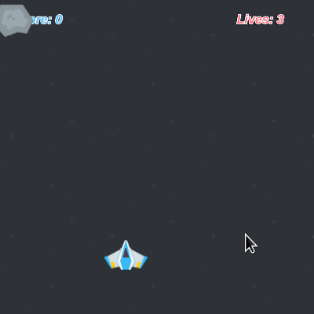

<h1 align="center">jogo no estilo Space Shooter</h5>

  

# Jogo_Space_Shooter
Criando seu jogo no estilo Space Shooter

##  Tarefas
  O controle das tarefas do projeto.

  *  Estrutura inicial
  *  Estilização do jogo
  *  Ações do Jogo
  *  Finalização do projeto.

##  Ícones
-  📦 Nova funcionalidade
-  🔄 Atualização
-  🐛 Correção de bug
-  🏁 Lançamento

   
  
  Desenvolvido em HTML, CSS e JS.

- Desafio prático realizado na plataforma [Digital Innovation One](https://web.digitalinnovation.one/home "Digital Innovation One"): [Criando seu jogo no estilo Space Shooter](https://web.digitalinnovation.one/project/criando-seu-jogo-no-estilo-space-shooter/learning/d02b301c-3245-431b-a2c6-51cfa3b58ebc?back=/track/javascript-game-developer&bootcamp_id=598f2ee3-6af1-4370-a843-2cb9afe2f70f").